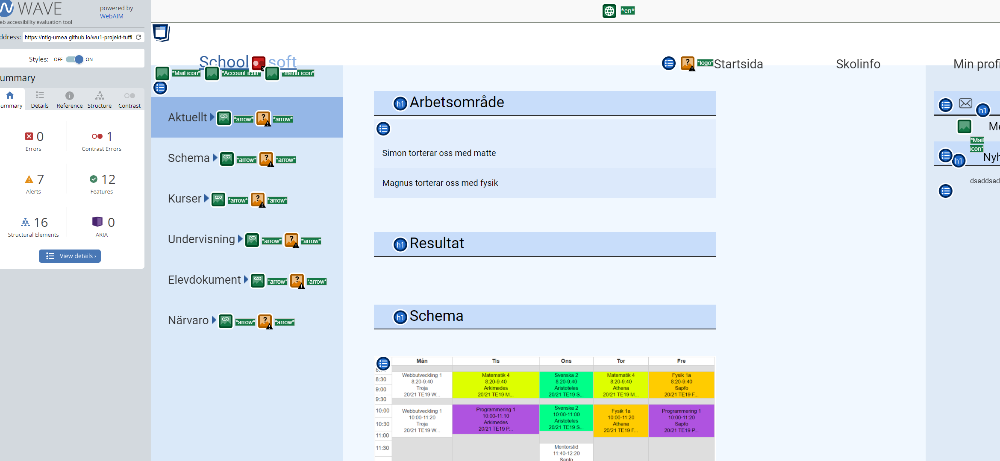
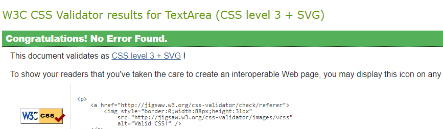
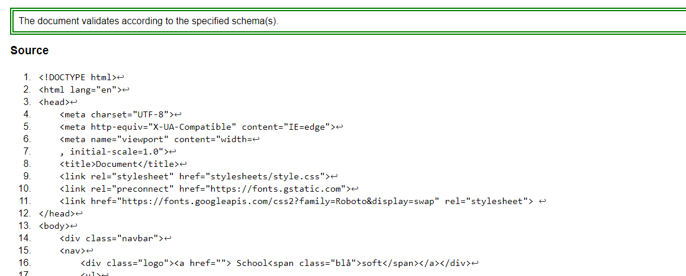
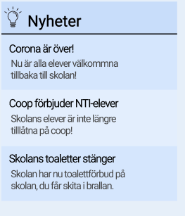

# Titel

Författare och datum.

## Inledning

Min plan var att göra en redesign på schoolsoft och koda om sidan i html och css kod, sidan ska se bra ut och fixa det som jag tycker att schoolsoft saknar, det viktigaste enligt mig är att sidan är responsiv, speciellt som mobilversion.

## Bakgrund

Jag började med att fundera över själva designen över och vad som behövde ändras från schoolsoft sida, det jag kom fram till var att jag ville bara allmänt skära ner på mängden text och information men samtidigt behålla relativt samma layout. Min plan var göra sidebaren till dropdown menyer och även använda mig mycket utav dropdown menyer för att få undan mycket information när man kommer till sidan men man kan fortfarande komma åt informationen lätt genom att trycka på en knapp. Jag ville även att man skulle kunna se schemat och matsedeln på landing pagen. Jag tog mig framåt ganska fort i kodningen, började med navbar och sedan de två sidebarsen, sist skulle jag få in all information på sidan. Sen var det bara kvar att göra sidan responsiv, jag valde att göra sidan för bredderna 1080px, 375px och 1280px. Jag validerade sedan både css och html, såg så att bilderna var optimerade och fungerade i githubpages. Jag optimerade bilderna genom att välja "alt" attribut till bilderna, samt kolla så att bilderna inte var för stora och så att det var rätt dimensioner på bilderna. Jag testade och evaluerade sidan även med WAVE.




```


Format: 
```


## Positiva erfarenheter

Jag tycker att jag har haft ett relativt bra flyt första delen utav arbetet, jag har relativt bra koll på att skapa olika grundläggande saker såsom navbar, sidebars osv. Själva designen tycker jag var rolig att komma på och skissa på, grunddesignen som jag gjorde i figma blev jag hyfsat nöjd med. Synd bara att jag inte fick ut den helt på i koden. Jag har jobbat på bra på de få lektionerna jag var med på, även lite hemma. Det gick bra med att göra sidan responsiv vilket jag behövde tänka på från kampanj uppgiften, Jag blev relativt nöjd med hur mobilverisionen och  responsiviteten på sidan blev då jag var ganska ny till det.

## Negativa erfarenheter

Jag hade väldigt mycket problem med många saker, det var nog min layout och hur jag hade lagt upp allt som vart lite för krångligt för mig att koda, jag visste inte riktigt hur jag skulle göra i många tillfällen och jag satt fast. Det jag hade störst problem med var mina dropdown menyer, jag hade redan kodad sidan utan knapparna men det blev väldigt svårt att få in dropdown menyerna i min kod. Det hade garanterat gått med mer tid då jag hade kunnat lära mig rejält och få kläm på hur man faktiskt gör. Jag provade några lösningar men det blev aldrig som jag hade tänkt mig, så jag valde att hålla mig borta från dem. Något jag kunde tänkt på innan var att inte lägga så stor energi/tid på designen och skissen samt även själva iden tog ett tag innan jag kom fram till. Detta gjorde att jag inte hade så mycket lektionstid på mig, jag var även borta ett par måndagar vilket gjorde att jag tappade ännu mer tid. Till nästa gång ska jag tänka att en skiss ska gå snabbt att göra och man behöver inte tänka på alla detaljer i en skiss. Jag måste även lära mig lite mer om javascript och dropdown menyer för att kunna implentera dem i framtida projekt. Det var även problem för mig att göra en header med under rubriker samt en bild bredvid headern. (se bilden nedan). Detta hade självklart även gått att lösa ifall jag lagt ned mera tid på projektet. Jag hade även råkat koda en bra bit in i koden i FEL repo vilket gjorde att jag behövde kopiera all min kod över till rätt, därav en väldigt stor commit. 



## Sammanfattning

Det finns definitivt mycket att utveckla på sidan då den saknar mycket från min originala skiss, jag måste lära mig lite mer om css kodning då jag hade mycket problem där, men samtidigt så måste jag tänka på att inte ta mig vatten över huvudet. Vi hade inte så mycket tid på oss, vilket jag visste om. Så jag skulle helt enkelt gått för en lite simplare design som jag visste att jag kunde klara av då jag visste själv att jag inte hade några förkunskaper om t.ex dropdown menyer. . Även att jag måste jobba mer hemma, jag tycker att det är väldigt roligt med webbutveckling och jag har vanligtvis inga problem att sitta flera timmar hemma och koda men nu så var jag lat (plus mycket annat med skolan) så därför blev min slutprodukt inte som jag hade tänkt mig. 